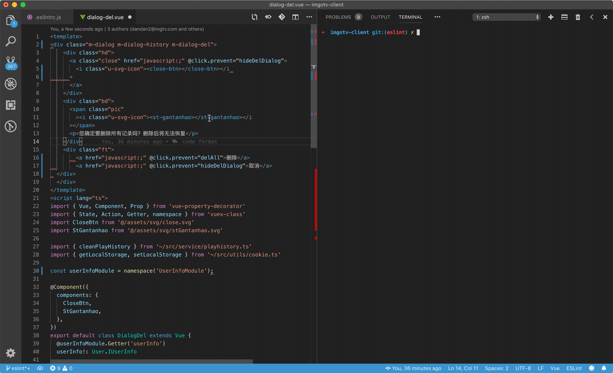

### Intro

前端项目很多，每个项目都有各自的配置（当前有些可能没有配置），而且配置项繁多：ESLint、Stylelint、Babel、Prettier、editconfig、gitignore、Git hooks & template.
项目目标为了统一各项目配置，统一团队风格，管理所有工程配置工作。



### Installation

Install universal-repo-config:

```
npm install universal-repo-config -D
```

universal-repo-config will annotate the original content, then append new content, including the following files:

```
  '.eslintrc.js',
  '.prettierrc.js',
  '.stylelintrc.js',
  '.gitignore',
  '.editorconfig',
```

Then, Install lint-staged & husky and add pre-commit settings in your `package.json`.

```
npm install lint-staged husky -D
```

Edit `package.json`, append code below:

```
  "lint-staged": {
    "**/**.{js,jsx,ts,pcss,vue}": [
      "prettier --write",
      "eslint --fix",
      "git add"
    ],
    "**/**.{css}": [
      "stylelint --fix",
      "git add"
    ]
  },
  "husky": {
    "hooks": {
      "pre-commit": "lint-staged"
    }
  }
```

If universal-repo-config is not installed during project initialization, you may need to format all the code using prettier.

```
npx prettier "**/**.{js,jsx,ts,pcss,json,md,vue}" --write
```

lint add the code using eslint

```
npx eslint "**/**.{js,jsx,ts,vue}" --fix
```

Install editor plugin:

- https://marketplace.visualstudio.com/items?itemName=esbenp.prettier-vscode
- https://marketplace.visualstudio.com/items?itemName=dbaeumer.vscode-eslint
- https://marketplace.visualstudio.com/items?itemName=shinnn.stylelint
- https://marketplace.visualstudio.com/items?itemName=octref.vetur

装好插件之后，打开 VS Code，进入 Settings（command + ,），进入 JSON 编辑器模式（点击右上角有一个 {} Open Settings JSON 按钮），添加以下配置：

```
  "eslint.alwaysShowStatus": true,
  "eslint.validate": [
    "javascript",
    // jsx
    "javascriptreact",
    // vue
    {
      "language": "vue",
      "autoFix": true
    },
    // ts
    {
      "language": "typescript",
      "autoFix": true
    },
    // tsx
    {
      "language": "typescriptreact",
      "autoFix": true
    },
    "html"
  ],
  "vetur.format.defaultFormatter.html": "prettier",
  "vetur.format.defaultFormatter.js": "prettier",
  "vetur.format.defaultFormatter.less": "prettier",
  "vetur.format.defaultFormatterOptions": {
    "prettier": {
      "semi": false,
      "singleQuote": true,
      "trailingComma": "es5"
    }
  },
```

编码的时候使用 `option + shift + F` 格式化代码。

Enjoy.